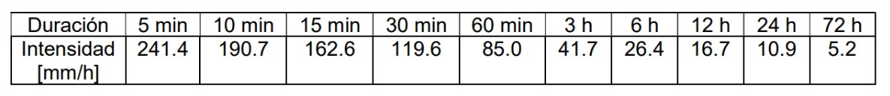
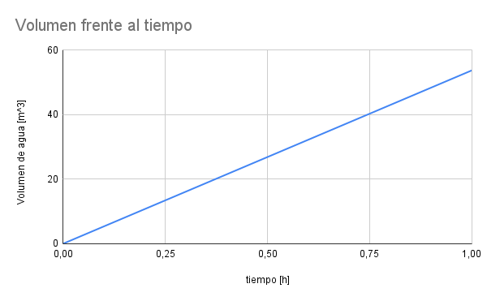
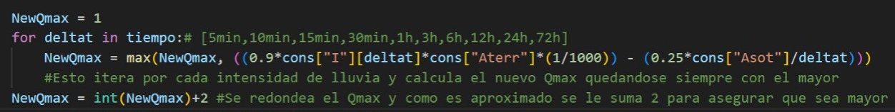

# Dimensionamiento de Bomba de Desagote
En el presente informe se llevara a cabo una serie de resoluciones de ecuaciones direfenciales ordinarias con el objetivo de simular una inundación provocada por una lluvia intensa, analizar las consecuencias en un edificio residencial con cocheras subterráneas y evaluar las
alternativas para mitigar los efectos de un evento climático. 

Para ello se modelará numéricamente el fenómeno físico analizado,
dimensionando la bomba para mitigar el efecto de inundaciones producidas por lluvias y experimentar con la resolución numérica del sistema.

Para llevar a cabo todo este ánalisis, se nos fueron brindadas las siguientes ecuaciones:

<u>Ecuación 1</u>: La conservación de masa tomando al sótano como volumen de control  

$\frac{\mathrm{d} V}{\mathrm{d} t} = Q_{ent} - Q_{sal}$

<u>Ecuación 2</u>: El caudal de entrada  

$Q_{ent} = C  I  A_{terr}$

<u>Ecuación 3</u>: El caudal de salida  

$Q_{sal} = Q_{max}\sqrt{\frac{\Delta H_{max} - \Delta H}{\Delta H_{max} - \Delta H_{min}}}$

<u>Ecuación 4</u>: El desnivel entre la superficie del agua y el desagote  

$\Delta H = H_{s} - H$

<u>Ecuación 5</u>: La altura de agua por encima del fondo del pozo 

$H = \frac{V}{A_{sot}}$

<u>Ecuación 6</u>: El coeficiente de infiltración  

$\frac{\mathrm{d} C}{\mathrm{d} t} = \frac{V}{V_{sot}t_{k}}(C_{sat} - C)$

Y también se nos brinda el siguiente cuadro:

#### Aclaraciones pertinentes:
- El padrón utilizado para llevar a cabo todas las cuentas a lo largo de todo este informe es $109566$.
- El valor de $h$ (el intervalo de tiempo) está siempre calculado en horas.
- Las mediciones físicas siempre se encuentran en $m$ (metros) y se realizarán las cuentas necesarias para realizar el pasaje de unidades de los datos brindados en otras unidades (como la $I$ en $mm/h$ o la $A_{terr}$ en $ha$)

### Punto A1
En una primera instancia, nuestro objetivo es correr el modelo para la precipitación de 60 min y verificar que el volumen de agua almacenado en el sótano coincida con el volumen de lluvia. Esto, suponiendo $C$ = 1 y $Q_{sal}$ = 0. Eso nos termina dejando: 

$\frac{\mathrm{d} V}{\mathrm{d} t} = Q_{ent} = I  A_{terr}$

Teniendo como dato $A_{terr} = 17.32m ∗ \frac{109566}{3000}m = 632,56104m^2$ y $V_{(t=0)} = 0$, aplicamos el método de Euler explícito utilizando un intervalo de tiempo $h = 0,1$. 

$V_{n+1} = V_{n} + h * (\frac{85 * 632,56104}{1000})$

(Dividimos por $1000$ para que la intensidad de lluvia, que se nos da en $mm/h$, nos quede en $m/h$)

Iterando hasta el minuto 60, es decir $h = 1$, obtenemos que el volumen de agua en el sótano es igual a $53,7676884m^2$ al alcanzar la hora.

Al tener un $Q_{ent}$ con valores constantes, el crecimiento del volumen de agua en el sótano en función del tiempo nos termina quedando lineal.

Entonces, se puede llegar a la conclusión de que nuestro $Q_{ent}$ puede calcularse simplemente multiplicando nuestra intensidad de lluvia ($I$) por el $A_{terr}$, es decir:

$\frac{85 * 632,56104}{1000}m^2 = 53,7676884m^2$

que como podemos observar nos devuelve el mismo valor obtenido anteriormente a través del método de Euler.

### Punto A2
En esta segunda instancia vamos a considerar $C$ y $Q_{sal}$ variables. Para ello utilizaremos todas las ecuaciones brindadas.

Correremos el modelo para todas las duraciones/intensidades de precipitación, en un lapso de tiempo suficiente como para que el sótano se vacíe. 

Ahora, tenemos dos ecuaciones para discretizar:

$\frac{\mathrm{d} V}{\mathrm{d} t} = Q_{ent} - Q_{sal}$

$\frac{\mathrm{d} C}{\mathrm{d} t} = \frac{V}{V_{sot}t_{k}}(C_{sat} - C)$

Como sabemos que $V_{(t=0)} = 0$ y $C_{(t=0)} = 0,6$ ambos son problemas de valores iniciales que pueden resolverse por Euler.

Desarrollando con los siguientes datos:

$A_{terr} = 17.32m ∗ \frac{109566}{3000}m = 632,56104m^2$  
$Q_{max} = 8 m^3/h$  
$\Delta H_{max} = 4m$  
$\Delta H_{min} = 1m$  
$H_{s} = 3,5m$  
$C_{sat} = 0,90$  
$t_{k} = (1 - \frac{109566}{140000})h = 0,2173857143h$  
$A_{sot} = 8,66m * 8,66m = 74,9956m^2$  
$V_{sot} = H_{s} * A_{sot} = 3,5m * 74,9956m^2 = 262,4846m^3$  
$\Delta H = H_{s} - H$  
$H = \frac{V}{A_{sot}} = \frac{V}{74,9956m^2} $  

Planteamos:

$V_{n+1} = V_{n} + h * ((C*I*A_{terr}) - (Q_{max}\sqrt{\frac{\Delta H_{max} - \Delta H}{\Delta H_{max} - \Delta H_{min}}}) )$

$C_{n+1} = C_{n} + h * (\frac{V}{V_{sot}t_{k}}(C_{sat} - C_{n}))$

Quedando:

$V_{n+1} = V_{n} + h * ((C*I*632,56104m^2) - (8 m^3/h\sqrt{\frac{4m - (3,5m - (\frac{V_{n}}{74,9956m^2}))}{4m - 1m}}) )$

$C_{n+1} = C_{n} + h * (\frac{V}{262,4846m^3 * 0,2173857143h}(0,90 - C_{n}))$

Como ambas ecuaciones dependen de la otra, no puede calcularse la siguiente iteración de una sin antes calcular la otra. Por esa razón, comenzamos calculando $C_{1}$ usando los valores de $C_{0}$ Y $V_{0}$, reemplazando a su vez con el $I$ correspondiente en cada entrada de la tabla. Una vez calculado, podemos calcular el $V_{1}$ y así continuamente.

Este planteo nos arrojó los siguientes resultados:

#### <u>Lluvia de 5 minutos</u>
Intensidad = $2414$ $m/h$  
Duración = $5/60$ $h$  

Resultado: tarda $2,25$ $h$ en vaciarse.

#### <u>Lluvia de 10 minutos</u>
Intensidad = $1907$ $m/h$  
Duración = $1/6$ $h$  

Resultado: tarda $3,4667$ $h$ en vaciarse.

#### <u>Lluvia de 15 minutos</u>
Intensidad = $162,6$ $m/h$  
Duración = $1/4$ $h$  

Resultado: tarda $4,3667$ $h$ en vaciarse.

#### <u>Lluvia de 30 minutos</u>
Intensidad = $119,6$ $m/h$  
Duración = $1/2$ $h$  

Resultado: tarda $6,2667$ $h$ en vaciarse.

#### <u>Lluvia de 60 minutos</u>
Intensidad = $85$ $m/h$  
Duración = $1$ $h$  

Resultado: tarda $8,8$ $h$ en vaciarse.

#### <u>Lluvia de 3 horas</u>
Intensidad = $41,7$ $m/h$  
Duración = $3$ $h$  

Resultado: tarda $13,4$ $h$ en vaciarse.

#### <u>Lluvia de 6 horas</u>
Intensidad = $26,4$ $m/h$  
Duración = $6$ $h$  

Resultado: tarda $17,8$ $h$ en vaciarse.

#### <u>Lluvia de 12 horas</u>
Intensidad = $16,7$ $m/h$  
Duración = $12$ $h$  

Resultado: tarda $23,9$ $h$ en vaciarse.

#### <u>Lluvia de 24 horas</u>
Intensidad = $10,9$ $m/h$  
Duración = $24$ $h$  

Resultado: tarda $33,3$ $h$ en vaciarse.

#### <u>Lluvia de 72 horas</u>
Intensidad = $5,2$ $m/h$  
Duración = $72$ $h$  

Resultado: tarda $0$ $h$ en vaciarse, nunca se llena.

La simulación reveló que el caudal de entrada $Q_{ent}$ varía significativamente con la intensidad de la precipitación, mientras que el caudal de salida $Q_{sal}$ depende directamente de la capacidad de la bomba y el desnivel $\Delta H$. 

En situaciones de baja precipitación pero de larga duración, como las lluvias de 3, 6 y 12 horas, el modelo arrojó los valores de volumen más elevados. Esto se debe a que la acumulación de agua se da de manera continua y sostenida. La entrada constante de agua, incluso a baja intensidad, supera la capacidad de desagote de la bomba durante periodos prolongados, lo que lleva a mayores volúmenes de agua acumulada.

Mientras que en condiciones de alta precipitación y corta duración, como las lluvias de 5, 10 y 15 minutos, se observan los valores de volumen más bajos. Esto se debe a que estas lluvias provocan una entrada de agua muy intensa pero breve. La bomba de desagote puede manejar el pico de entrada de agua de manera eficiente, dado que la duración es limitada y no permite una acumulación significativa de agua en el sótano.

La bomba tiene una capacidad máxima de desagote que puede manejar altos caudales por períodos cortos. En cambio, durante lluvias prolongadas, la capacidad de desagote puede no ser suficiente para compensar la entrada continua de agua. 

En el caso específico de la lluvia de 72 horas, la intensidad de lluvia es tan baja que el caudal de entrada $Q_{ent}$ nunca supera el caudal de salida $Q_{sal}$. Esto resulta en que el volumen de agua en el sótano se mantiene en cero o en valores negativos. Esto significa que cualquier agua que entre en el sistema es desagotada inmediatamente. La bomba de desagote es capaz de manejar completamente el caudal de entrada, desagotando el agua de manera eficiente y manteniendo el volumen de agua en el sótano en cero. 

### Punto B
Ahora, nos encontramos ante el desafío de redimensionar la bomba adoptando un nuevo valor para la variable $Q_{max}$ para que la altura del agua sobre el piso del sótano jamás exceda los $0,25m$ para ninguna de las precipitaciones presentes en la tabla brindada. 

Sabiendo que:

$H = \frac{V}{A_{sot}}$

y teniendo el valor $A_{sot} = 74,9956$, se debe cumplir que $H < 0,25$, podemos despejar y nos queda que:

$\frac{V}{74,9956} < 0,25$  
$V < 0,25 * 74,9956$  
$V < 18,7489$  

Si buscamos aproximar a $V$ asumiendo a $Q_{ent}$ y $Q_{sal}$ como constantes, podemos plantear que:

$V = h*(Q_{ent} - Q_{sal})$

Nos termina quedando que: 

$h*(Q_{ent} - Q_{sal}) < 18,7489$

Lo cual es igual a:

$h*((\frac{C*I*A}{1000}) - (Q_{max}\sqrt{\frac{\Delta H_{max} - \Delta H}{\Delta H_{max} - \Delta H_{min}}})) < 18,7489$

Como lo que queremos es maximizar es el $Q_{sal}$ buscamos que  $\sqrt{\frac{\Delta H_{max} - \Delta H}{\Delta H_{max} - \Delta H_{min}}} = 1$ así obtenemos el $Q_{max}$, por lo tanto nos queda:

$h*(\frac{C*I*A}{1000} - Q_{max}) < 18,7489$

El mayor valor posible para nuestro $Q_{ent}$ se da cuando nuestra $C$ es igual $0,9$. En nuestro caso, el valor de $A_{terr}$ es de $632,56104m^2$. 

Esto nos dejaría que nuestro $Q_{ent}$ máximo es:

$Q_{ent} = \frac{0,9 * I * 632,56104}{1000}$

Lo que nos deja:

$(\frac{0,9 * I * 632,56104}{1000} - \frac{18,7489}{h}) < Q_{max}$

Al probar esto con cada una de las intensidades a través de esta función:

Se llega a la que conclusión de que para lograr que la altura de agua sobre el piso del sótano no exceda los $0,25m$ para ninguna de las precipitaciones de la tabla se necesita un $Q_{max} >= 32$. Así, el sistema tiene la capacidad suficiente para drenar el agua de manera eficiente, incluso durante las precipitaciones más intensas registradas en la tabla, ya que la bomba puede manejar el flujo de agua entrante de manera adecuada.

### Punto C

Se nos pide ahora discretizar las ecuaciones 1 y 6 con el método de Runge-Kutta de orden 2, considerando esta solución como “exacta”. Luego, debemos correr este modelo para la precipitación de 60 min con el método de Runge-Kutta de orden 2, y luego con Euler con dos pasos de tiempo distintos. Además, debemos verificar que Euler es de orden 1 analizando la diferencia con la solución “exacta”, utilizando siempre el $Q_{max}$ obtenido anteriormente en el punto B. 

Decidimos correr el modelo primero con un $h = 1 min$ y notamos que los valores de Runge-Kutta y Euler eran bastantes similares, con diferencias bastante pequeñas:

Para poder ver errores más grandes corrimos nuevamente el modelo pero ahora utilizando $h = 10 min$:

y $h = 30 min$

Al comparar los resultados obtenidos utilizando diferentes tamaños de paso $h$, hemos examinado el error en relación con la solución obtenida mediante el método de Runge-Kutta de segundo orden, considerado como la solución "exacta". Los resultados destacan una disminución proporcional y lineal del error global con respecto al tamaño del paso, lo que confirma la naturaleza de primer orden del método de Euler.  

Cuando comparamos los errores relativos con un paso de tiempo $h = 10 min$ vamos que son linealmente proporcionales a los obtenidos cuando $h = 30 min$. Es decir, se cumple que teniendo $\epsilon_{1}$ y $\epsilon_{2}$ para pasos de tiempo $\Delta t_{1}$ y $\Delta t_{2} = \Delta t_{1} / 3 $, encontramos que:

$\frac{\epsilon_{2}}{\epsilon_{1}} \approx \frac{\Delta t_2}{\Delta t_1} = \frac{\Delta t_{1} / 3}{\Delta t_1} =  \frac{1}{3}$

Como esto se cumple y el error se reduce aproximadamente a un tercio cuando reducimos el paso de tiempo a un tercio, se confirma que el método de Euler es de orden 1. Lo mismo ocurre cuando comparamos $h = 1 min$ con $h = 30 min$, solo que esta vez:

$\frac{\epsilon_{2}}{\epsilon_{1}} \approx \frac{\Delta t_2}{\Delta t_1} = \frac{\Delta t_{1} / 30}{\Delta t_1} =  \frac{1}{30}$

Además, es notable que las disparidades entre las soluciones de Euler y RK2 son insignificantes para pasos de tiempo reducidos, pero aumentan significativamente al incrementar el tamaño del paso. Este comportamiento también es coherente con las expectativas de un método de primer orden.  

### Punto D

#### Conclusiones finales  

En este trabajo práctico se abordó la resolución numérica de un problema físico de gran relevancia: el dimensionamiento de una bomba de desagote en un edificio con sótano, afectado por lluvias intensas. A continuación, se detallan las conclusiones principales derivadas del análisis y la modelación realizados:  

1. **Relación Problema Físico-Problema Numérico**:  
   El problema físico consiste en gestionar el agua de lluvia que ingresa a un sótano durante una inundación. Este fenómeno se modeló mediante ecuaciones diferenciales ordinarias que describen la conservación de masa y la variación del coeficiente de infiltración.  
   La transformación del problema físico a un problema numérico permitió utilizar métodos de resolución como Euler y Runge-Kutta, facilitando la simulación y análisis del sistema en distintos escenarios de precipitación.  

2. **Tipos de Errores en la Resolución Numérica**:  
   **Error de Truncamiento**: En el método de Euler, este error es del orden de $\Delta t$, mientras que en Runge-Kutta de segundo orden, el error es del orden de $(\Delta t)^2$. Esto se evidenció en las diferencias observadas al comparar los resultados de Euler con los de Runge-Kutta.  
   **Error de Redondeo**: Proviene de la precisión finita de las computadoras. Al tener una mantisa finita y limitada, los resultados que utilizan los programas empleados para desarrollar este trabajo práctico no son exactos.  

3. **Importancia y Efecto de los Errores**:  
   Los errores numéricos pueden influir en la precisión del cálculo del caudal necesario y, por ende, en la selección de la bomba adecuada. Un error significativo podría llevar a subdimensionar o sobredimensionar la bomba. 
   La diferencia entre las soluciones obtenidas con distintos métodos numéricos demuestra la necesidad de seleccionar adecuadamente el método y el paso de tiempo según la precisión requerida. 

4. **Estabilidad y Consistencia**: 
   **Estabilidad**: Ambos métodos utilizados son condicionalmente estables y dependen del tamaño del paso de tiempo $\Delta t$ elegido. Un $\Delta t$ demasiado grande puede llevar a soluciones inestables.  
   **Consistencia**: Ambos métodos son consistentes, pero el orden de consistencia varía. Runge-Kutta de segundo orden es más preciso para el mismo paso de tiempo en comparación con Euler. 

En resumen, el trabajo realizado demuestra la importancia de un enfoque numérico adecuado para resolver problemas físicos complejos. La elección de los métodos y parámetros numéricos a utilizar es esencial para obtener soluciones precisas y eficientes.